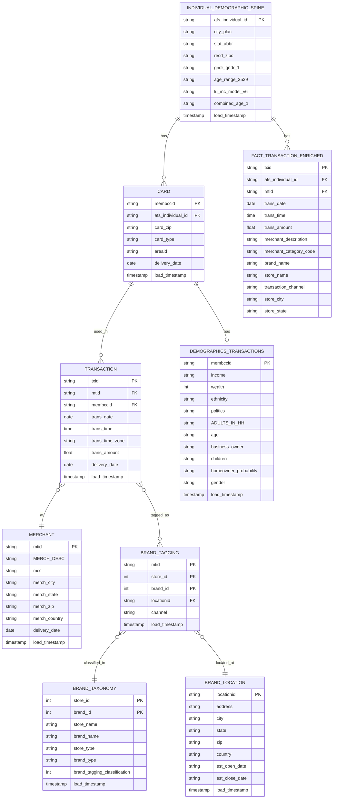

## Data Model ERD

### Entity Relationship Diagram

- **INDIVIDUAL_DEMOGRAPHIC_SPINE** (1) ──────< (N) **CARD**: One individual can have many cards
- **CARD** (1) ──────< (N) **TRANSACTION**: One card can have many transactions
- **TRANSACTION** (N) ──────> (1) **MERCHANT**: Many transactions can be at one merchant
- **TRANSACTION** (N) ──────< (M) **BRAND_TAGGING**: Many transactions can be tagged with many brands
- **BRAND_TAGGING** (N) ──────> (1) **BRAND_TAXONOMY**: Many brand taggings reference one brand taxonomy
- **BRAND_TAGGING** (N) ──────> (1) **BRAND_LOCATION**: Many brand taggings reference one location
- **INDIVIDUAL_DEMOGRAPHIC_SPINE** (1) ──────< (N) **FACT_TRANSACTION_ENRICHED**: Many transactions belong to one individual

### Data Model Notes

- **DIM_INDIVIDUAL** (from `INDIVIDUAL_DEMOGRAPHIC_SPINE`): One row per individual with 800+ demographic attributes
- **FACT_TRANSACTION_ENRICHED**: Denormalized transaction table with `afs_individual_id` for easy joining
- Both tables have `afs_individual_id` as a bridge for flexible querying
- Transactions are kept separate from individual attributes for optimal LLM query performance