## Data Model ERD

### Entity Relationship Diagram

```mermaid
erDiagram
    %% Source Tables
    INDIVIDUAL_DEMOGRAPHIC_SPINE ||--|| V_AKKIO_ATTRIBUTES_LATEST : "transforms_to"
    TRANSACTION ||--o{ FACT_TRANSACTION_ENRICHED : "enriches"
    CARD ||--o{ FACT_TRANSACTION_ENRICHED : "provides_AKKIO_ID"
    MERCHANT ||--o{ FACT_TRANSACTION_ENRICHED : "enriches"
    BRAND_TAGGING ||--o{ FACT_TRANSACTION_ENRICHED : "enriches"
    BRAND_TAXONOMY ||--o{ FACT_TRANSACTION_ENRICHED : "enriches"
    BRAND_LOCATION ||--o{ FACT_TRANSACTION_ENRICHED : "enriches"
    TRANSACTION }o--|| CARD : "uses"
    TRANSACTION }o--|| MERCHANT : "at"
    TRANSACTION }o--o{ BRAND_TAGGING : "tagged_as"
    BRAND_TAGGING }o--|| BRAND_TAXONOMY : "classified_in"
    BRAND_TAGGING }o--|| BRAND_LOCATION : "located_at"
    
    %% dbt Model Relationships
    V_AKKIO_ATTRIBUTES_LATEST ||--o{ FACT_TRANSACTION_ENRICHED : "has"
    FACT_TRANSACTION_ENRICHED ||--|| FACT_TRANSACTION_SUMMARY : "aggregates_to"
    V_AKKIO_ATTRIBUTES_LATEST ||--|| V_AGG_AKKIO_IND : "aggregates_to"
    V_AKKIO_ATTRIBUTES_LATEST ||--|| V_AGG_AKKIO_HH : "aggregates_to"
    
    %% Source Table Definitions
    INDIVIDUAL_DEMOGRAPHIC_SPINE {
        string afs_individual_id PK
        string city_plac
        string stat_abbr
        string recd_zipc
        string gndr_gndr_1
        string combined_age_1
        string lu_inc_model_v6
        timestamp load_timestamp
    }
    
    TRANSACTION {
        string txid PK
        string mtid FK
        string membccid FK
        date trans_date
        time trans_time
        string trans_time_zone
        float trans_amount
        date delivery_date
        timestamp load_timestamp
    }
    
    CARD {
        string membccid PK
        string afs_individual_id FK
        string card_zip
        string card_type
        string areaid
        date delivery_date
        timestamp load_timestamp
    }
    
    MERCHANT {
        string mtid PK
        string MERCH_DESC
        string mcc
        string merch_city
        string merch_state
        string merch_zip
        string merch_country
        date delivery_date
        timestamp load_timestamp
    }
    
    BRAND_TAGGING {
        string mtid PK
        int store_id PK
        int brand_id PK
        string locationid FK
        string channel
        timestamp load_timestamp
    }
    
    BRAND_TAXONOMY {
        int store_id PK
        int brand_id PK
        string store_name
        string brand_name
        string store_type
        string brand_type
        int brand_tagging_classification
        timestamp load_timestamp
    }
    
    BRAND_LOCATION {
        string locationid PK
        string address
        string city
        string state
        string zip
        string country
        string est_open_date
        string est_close_date
        timestamp load_timestamp
    }
    
    %% dbt Model Definitions
    V_AKKIO_ATTRIBUTES_LATEST {
        string AKKIO_ID PK
        string AKKIO_HH_ID
        date PARTITION_DATE
        string GENDER
        int AGE
        string AGE_BUCKET
        int YEAR_OF_BIRTH
        string ETHNICITY
        string EDUCATION_LEVEL
        string EDUCATION_MODEL
        string MARITAL_STATUS
        string HOMEOWNER_STATUS
        string HOUSEHOLD_INCOME_K
        string INCOME_BUCKET
        string WEALTH
        string WEALTH_BUCKET
        string POLITICS
        string POLITICS_NORMALIZED
        string BUSINESS_OWNER
        string BUSINESS_OWNER_FLAG
        int ADULTS_IN_HH
        int CHILDREN
        string STATE_ABBR
        string ZIP_CODE
        string CITY
        string COUNTY_NAME
        string CBSA_CODE
        string CBSA_TYPE
        string METRO_FLAG
        string MARKET_AREA_TYPE
    }
    
    FACT_TRANSACTION_ENRICHED {
        string txid PK
        string AKKIO_ID FK
        date trans_date
        time trans_time
        string trans_time_zone
        float trans_amount
        date transaction_delivery_date
        string membccid
        string card_type
        string card_zip
        string areaid
        string mtid
        string merchant_description
        string merchant_category_code
        string merchant_city
        string merchant_state
        string merchant_zip
        string merchant_country
        int store_id
        int brand_id
        string transaction_channel
        string locationid
        string store_name
        string brand_name
        string store_type
        string brand_type
        string brand_tagging_classification
        string store_address
        string store_city
        string store_state
        string store_zip
        string store_country
        string store_open_date
        string store_close_date
    }
    
    FACT_TRANSACTION_SUMMARY {
        date trans_date PK
        string AKKIO_ID PK
        int transaction_count
        float total_transaction_amount
        float avg_transaction_amount
        float min_transaction_amount
        float max_transaction_amount
        string trans_time_zone
        date latest_delivery_date
        date earliest_delivery_date
        string card_type
        string card_zip
        string areaid
        string merchant_description_str_list
        string merchant_category_code_str_list
        string merchant_city_str_list
        string merchant_state_str_list
        string merchant_zip_str_list
        string merchant_country_str_list
        string store_name_str_list
        string brand_name_str_list
        string store_type_str_list
        string brand_type_str_list
        string brand_tagging_classification_str_list
        string transaction_channel_str_list
        string store_city_str_list
        string store_state_str_list
        string store_zip_str_list
        string store_country_str_list
        int unique_merchant_count
        int unique_store_count
        int unique_brand_count
        int unique_mcc_count
        int unique_channel_count
    }
    
    V_AGG_AKKIO_IND {
        string AKKIO_ID PK
        string AKKIO_HH_ID
        int WEIGHT
        string GENDER
        int AGE
        string AGE_BUCKET
        string ETHNICITY
        string EDUCATION_LEVEL
        string MARITAL_STATUS
        string HOMEOWNER
        string INCOME
        string INCOME_BUCKET
        string WEALTH
        string WEALTH_BUCKET
        string POLITICS
        string POLITICS_NORMALIZED
        string BUSINESS_OWNER
        string BUSINESS_OWNER_FLAG
        int ADULTS_IN_HH
        int CHILDREN
        int MAIDS
        int IPS
        int EMAILS
        int PHONES
        string STATE_ABBR
        string ZIP_CODE
        string CITY
        string COUNTY_NAME
        string CBSA_CODE
        string CBSA_TYPE
        string METRO_FLAG
        string MARKET_AREA_TYPE
        string EDUCATION_MODEL
        int YEAR_OF_BIRTH
        date PARTITION_DATE
    }
    
    V_AGG_AKKIO_HH {
        string AKKIO_HH_ID PK
        int HH_WEIGHT
        string HOMEOWNER
        string INCOME
        string INCOME_BUCKET
        string WEALTH
        string WEALTH_BUCKET
        int ADULTS_IN_HH
        int CHILDREN
        string STATE_ABBR
        string ZIP_CODE
        string CITY
        string COUNTY_NAME
        date PARTITION_DATE
    }
```

### Source Table Relationships (Data Lineage)

- **INDIVIDUAL_DEMOGRAPHIC_SPINE** → **V_AKKIO_ATTRIBUTES_LATEST**: Source table transformed into normalized individual attributes dimension
- **TRANSACTION** → **FACT_TRANSACTION_ENRICHED**: Core transaction facts enriched with additional attributes
- **CARD** → **FACT_TRANSACTION_ENRICHED**: Provides `AKKIO_ID` via `membccid` join (LEFT JOIN)
- **MERCHANT** → **FACT_TRANSACTION_ENRICHED**: Provides merchant details via `mtid` join (LEFT JOIN)
- **BRAND_TAGGING** → **FACT_TRANSACTION_ENRICHED**: Provides brand/store IDs and channel via `mtid` join (LEFT JOIN)
- **BRAND_TAXONOMY** → **FACT_TRANSACTION_ENRICHED**: Provides brand/store names and classifications via `store_id` + `brand_id` join from BRAND_TAGGING (LEFT JOIN)
- **BRAND_LOCATION** → **FACT_TRANSACTION_ENRICHED**: Provides store location details via `locationid` join from BRAND_TAGGING (LEFT JOIN)
- **TRANSACTION** (N) ──────> (1) **CARD**: Many transactions use one card
- **TRANSACTION** (N) ──────> (1) **MERCHANT**: Many transactions occur at one merchant
- **TRANSACTION** (N) ──────< (M) **BRAND_TAGGING**: Many transactions can be tagged with many brands
- **BRAND_TAGGING** (N) ──────> (1) **BRAND_TAXONOMY**: Many brand taggings reference one brand taxonomy
- **BRAND_TAGGING** (N) ──────> (1) **BRAND_LOCATION**: Many brand taggings reference one location

### dbt Model Relationships

- **V_AKKIO_ATTRIBUTES_LATEST** (1) ──────< (N) **FACT_TRANSACTION_ENRICHED**: One individual can have many transactions
- **FACT_TRANSACTION_ENRICHED** (N) ──────> (1) **FACT_TRANSACTION_SUMMARY**: Many transaction detail rows aggregate to one daily summary row per individual
- **V_AKKIO_ATTRIBUTES_LATEST** (1) ──────> (1) **V_AGG_AKKIO_IND**: One individual aggregates to one individual aggregation row
- **V_AKKIO_ATTRIBUTES_LATEST** (1) ──────> (1) **V_AGG_AKKIO_HH**: One individual aggregates to one household aggregation row (currently 1:1, structured for future household scenarios)

### Data Model Notes

#### dbt Models

- **V_AKKIO_ATTRIBUTES_LATEST**: Individual Attributes Dimension - One row per individual with all normalized demographic attributes. Primary key is `AKKIO_ID` (formerly `afs_individual_id`). Contains 800+ demographic attributes with normalized values for gender, ethnicity, politics, income, wealth, etc. Generated from `INDIVIDUAL_DEMOGRAPHIC_SPINE` source table.

- **FACT_TRANSACTION_ENRICHED**: Detail Transaction Fact Table - Denormalized transaction table with `AKKIO_ID` for easy joining to attributes table. Contains granular detail about each individual transaction. Built by joining 6 source tables:
  - **TRANSACTION** (base table): Transaction facts (txid, trans_date, trans_time, trans_amount, etc.)
  - **CARD** (LEFT JOIN on `membccid`): Provides `AKKIO_ID` via `afs_individual_id`, plus card attributes
  - **MERCHANT** (LEFT JOIN on `mtid`): Provides merchant description, MCC, and location
  - **BRAND_TAGGING** (LEFT JOIN on `mtid`): Provides store_id, brand_id, channel, and locationid
  - **BRAND_TAXONOMY** (LEFT JOIN on `store_id` + `brand_id`): Provides store/brand names and classifications
  - **BRAND_LOCATION** (LEFT JOIN on `locationid`): Provides store address and location details
  - **Materialization**: Incremental table (clustered by trans_date, AKKIO_ID)
  - **Note**: Use `FACT_TRANSACTION_SUMMARY` for most queries unless transaction-level detail is required

- **FACT_TRANSACTION_SUMMARY**: Daily Transaction Summary Table - Aggregated transaction activity per day and individual (`trans_date`, `AKKIO_ID`). Optimized for RAG engine queries that need summary-level data. Contains transaction metrics (count, totals, averages), aggregated merchant/brand attributes as comma-separated lists, and unique counts. Source: `FACT_TRANSACTION_ENRICHED`.
  - **Grain**: One row per day per individual (trans_date, AKKIO_ID)
  - **Materialization**: Table (clustered by trans_date, AKKIO_ID)
  - **Use Case**: Preferred table for most analytics queries; use `FACT_TRANSACTION_ENRICHED` only when transaction-level detail is needed

- **V_AGG_AKKIO_IND**: Individual Aggregation Table - One row per individual (`AKKIO_ID`) with aggregated demographic attributes optimized for analytics. Generated from `V_AKKIO_ATTRIBUTES_LATEST`. Includes weight field and contact identifier placeholders (MAIDS, IPS, EMAILS, PHONES).

- **V_AGG_AKKIO_HH**: Household Aggregation Table - One row per household (`AKKIO_HH_ID`) with household-level attributes. Generated from `V_AKKIO_ATTRIBUTES_LATEST`. Currently 1:1 with individuals but structured for future scenarios where multiple individuals may share a household.

#### Design Principles

- Both `V_AKKIO_ATTRIBUTES_LATEST` and transaction tables use `AKKIO_ID` as the bridge for flexible querying
- Transactions are kept separate from individual attributes for optimal LLM query performance
- `FACT_TRANSACTION_SUMMARY` provides aggregated daily summaries optimized for RAG queries; use `FACT_TRANSACTION_ENRICHED` only when transaction-level detail is required
- All demographic fields are normalized (e.g., GENDER: MALE/FEMALE/UNKNOWN, ETHNICITY: HISPANIC/AFRICAN_AMERICAN/etc., POLITICS_NORMALIZED: DEMOCRAT_KNOWN/REPUBLICAN_INFERRED/etc.)
- All joins in `FACT_TRANSACTION_ENRICHED` are LEFT JOINs to preserve all transactions even if enrichment data is missing
- `FACT_TRANSACTION_ENRICHED` uses incremental materialization for efficient processing of new transactions
